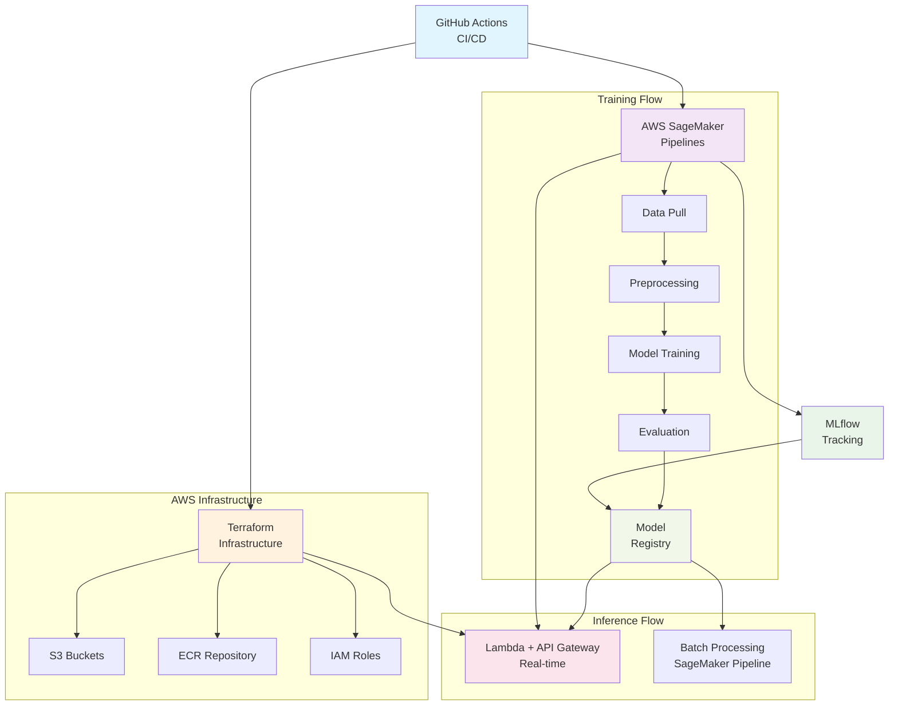

# UTEC Bank - Customer Attrition Prediction (Grupo 5)

🎥 **Video Demo**: https://www.loom.com/share/e3adc48819624067b062b7c86935d054

A complete MLOps solution for predicting customer attrition using AWS SageMaker, MLflow, and automated CI/CD pipelines.

## 🏗️ Architecture Overview

This project implements a production-ready machine learning pipeline with three main components:

1. **CI/CD Pipeline** - Infrastructure provisioning and deployment automation
2. **Training Pipeline** - Automated model training, evaluation, and registration
3. **Inference Pipeline** - Both batch and real-time prediction capabilities



## 🚀 Features

- **Automated Training**: Weekly scheduled model retraining with hyperparameter optimization
- **Model Comparison**: Evaluates LightGBM, XGBoost, and Random Forest models
- **Quality Gates**: Only registers models with F1 score ≥ 0.4
- **Real-time Inference**: REST API endpoint for live predictions
- **Batch Processing**: SageMaker pipeline for large-scale scoring
- **MLflow Integration**: Complete experiment tracking and model versioning
- **Infrastructure as Code**: Terraform-managed AWS resources

## 📁 Project Structure

```
├── .github/workflows/
│   └── main.yml                    # CI/CD pipeline
├── terraform/
│   ├── main.tf                     # AWS infrastructure
│   ├── variables.tf                # Configuration variables
│   └── backend.tf                  # Terraform backend config
├── pipeline_train/
│   ├── train_pipeline.ipynb        # Training pipeline orchestration
│   ├── model_training_requirements.txt
│   ├── Clean_data_requirements.txt
│   └── data_pull_requirements.txt
├── pipeline_inference/
│   ├── pipeline_inference.ipynb    # Batch inference pipeline
│   └── data_pull_requirements.txt
├── src/
│   ├── entrypoint.py               # Lambda function handler
│   ├── Dockerfile                  # Lambda container image
│   └── requirements.txt            # Python dependencies
└── README.md
```

## 🔧 Prerequisites

- AWS Account with appropriate permissions
- Terraform >= 1.0.0
- Docker
- Python 3.9+
- SageMaker Studio access

## 🛠️ Setup Instructions

### 1. Infrastructure Deployment

The CI/CD pipeline automatically deploys infrastructure when pushing to `main` or `develop` branches:

```bash
git push origin main  # Deploys to production
git push origin develop  # Deploys to test environment
```

**Manual deployment:**
```bash
cd terraform/
terraform init
terraform plan
terraform apply
```

### 2. Training Pipeline Setup

1. Open SageMaker Studio
2. Navigate to [pipeline_train/train_pipeline.ipynb](pipeline_train/train_pipeline.ipynb)
3. Run all cells to create and execute the training pipeline

**Key configuration:**
```python
user = "grupo5"
TRACKING_SERVER = "mlflow-tracking-server-grupo5"
default_bucket = "s3-mlflow-artifacts-mlflow-tracking-server-grupo5-01"
pipeline_name = f"pipeline-train-{user}"
model_name = f"model-attrition-{user}"
```

### 3. Inference Setup

**Batch Inference:**
```python
# In pipeline_inference/pipeline_inference.ipynb
pipeline.start(parameters={"PeriodoCarga": 202501})
```

**Real-time Inference:**
```bash
curl -X POST https://your-api-gateway-url/test/invoke \
  -H "Content-Type: application/json" \
  -d '{
    "body": "{\"input_data\": {
      \"flg_bancarizado\": 1,
      \"edad\": 35,
      \"antiguedad\": 5,
      \"sdo_activo_menos0\": 1000,
      \"flg_seguro_menos0\": 1,
      \"flg_nomina\": 1,
      \"nro_acces_canal1_menos0\": 5,
      \"nro_acces_canal2_menos0\": 2,
      \"nro_acces_canal3_menos0\": 1,
      \"flag_lima_provincia_encoded\": 1,
      \"rang_ingreso_encoded\": 2,
      \"rang_sdo_pasivo_menos0_encoded\": 1
    }}"
  }'
```

## 🤖 Model Training Details

### Data Sources
- **Database**: `glue-catalog-database-utec-bank-01`
- **Tables**: `clientes`, `requerimientos`
- **Features**: 15 key features including customer demographics, account activity, and channel usage

### Model Pipeline
1. **Data Pull**: Athena query execution
2. **Preprocessing**: Missing value imputation, encoding, feature selection
3. **Training**: Multi-model training with hyperparameter tuning
4. **Evaluation**: F1 score comparison across models
5. **Registration**: Conditional model registration based on performance threshold

### Automated Scheduling
Training pipeline runs automatically every Monday at 2 AM UTC via EventBridge Scheduler.

## 📊 Model Features

The final model uses these key features:
- `flg_bancarizado` - Banking relationship flag
- `edad` - Customer age
- `antiguedad` - Account tenure
- `sdo_activo_menos0/1/2` - Active balance (current and previous months)
- `flg_seguro_menos0/1/2` - Insurance flags
- `nro_acces_canal1/2/3_menos0` - Channel access counts
- `flg_nomina` - Payroll flag
- `flag_lima_provincia_encoded` - Geographic encoding
- `rang_ingreso_encoded` - Income range encoding
- `rang_sdo_pasivo_menos0_encoded` - Passive balance range encoding

## 🔄 CI/CD Pipeline

The GitHub Actions workflow ([.github/workflows/main.yml](.github/workflows/main.yml)) includes:

1. **Environment Detection**: Automatic prod/test environment selection
2. **Docker Build**: Lambda container image creation
3. **ECR Push**: Image deployment to Amazon ECR
4. **Infrastructure Deployment**: Terraform apply with state management
5. **Security**: Environment-specific AWS credentials

## 🏛️ AWS Resources

**Core Infrastructure:**
- SageMaker MLflow Tracking Server
- Lambda Function (containerized)
- API Gateway REST API
- S3 Buckets (artifacts, versioned)
- IAM Roles and Policies
- ECR Repository

**Configuration:**
```hcl
# Key variables in terraform/variables.tf
aws_region = "us-east-1"
tracking_server_name = "mlflow-tracking-server-grupo5"
lambda_function_name = "lmb-mlflow-sagemaker-01"
api_gateway_name = "mlflow-sagemaker-api"
```

## 📈 Monitoring & Observability

- **MLflow Experiments**: Track training runs, metrics, and artifacts
- **Model Registry**: Version control for production models  
- **CloudWatch Logs**: Lambda execution monitoring
- **Pipeline Metrics**: Training and inference performance tracking

## 🔍 API Response Format

```json
{
  "statusCode": 200,
  "body": {
    "message": "Éxito",
    "churn_probability": 0.75,
    "no_churn_probability": 0.25,
    "binary_prediction": 1,
    "prediction_label": "CHURN"
  }
}
```

## 🚨 Error Handling

- **Training Pipeline**: Conditional registration prevents poor model deployment
- **Lambda Function**: Comprehensive error handling with detailed logging
- **Infrastructure**: Resource validation and rollback capabilities

## 🤝 Contributing

1. Create feature branch from `develop`
2. Make changes and test locally
3. Push to feature branch
4. Create pull request to `develop`
5. After approval, merge to `develop` (auto-deploys to test)
6. Merge to `main` for production deployment

## 📋 Environment Variables

**Lambda Configuration:**
```
MLFLOW_TRACKING_URI = aws_sagemaker_mlflow_tracking_server.mlflow_server.tracking_server_url
MLFLOW_TRACKING_SERVER_ARN = aws_sagemaker_mlflow_tracking_server.mlflow_server.arn
GIT_PYTHON_REFRESH = "quiet"
```

## 🏷️ Versioning

- **Models**: Semantic versioning in MLflow Model Registry
- **Infrastructure**: Git-based versioning with Terraform state
- **Docker Images**: Tagged with `latest` for Lambda deployment

## 📞 Team members

1. Diego Flores Gonzales
2. Sebastian Aguedo Zúñiga
3. Hugo Armejo Pascual
4. Germain Garcia Zanabria

---

**Grupo 5 - UTEC MLOps Project**